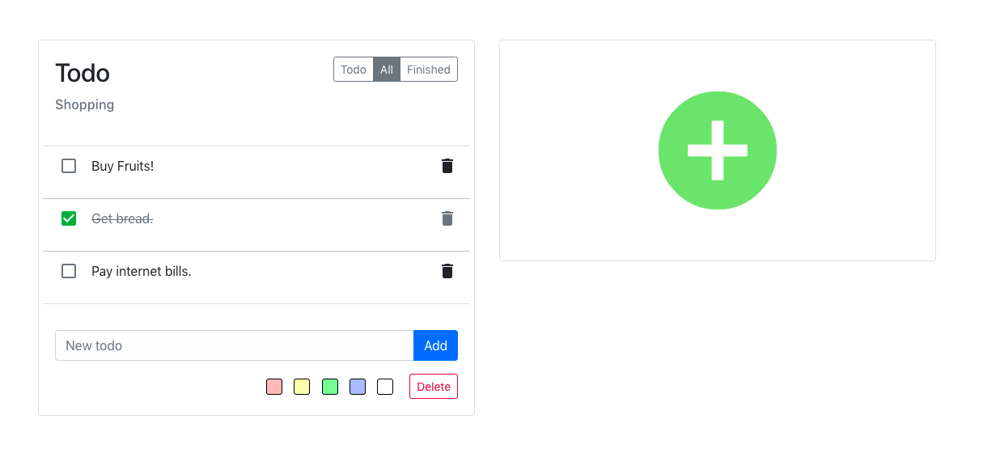

## VueJS-Todo

A simple todo app using Vue.js. [Demo](https://chirathr.github.io/vue-todo/)



### Installation

Node and npm is required to build this project.

```bash
npm install
```

### Run the dev server

```bash
npm run dev
```

This will create a dev server with auto reload.
